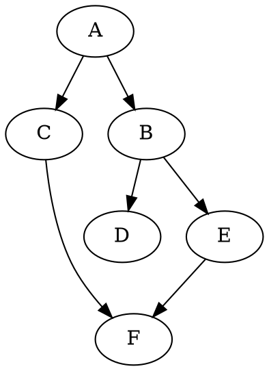

- - -
###### 关于作者
> 
> **`张帅，网络从业人员，公众号：Flowlet`**
> 
> **`个人博客：https://flowlet.net/`**
- - -

## 前言
- - -


无论是数据中心内的整网网络拓扑，还是网络设备内的业务转发逻辑（如开源用户态网络协议栈 VPP：Vector Packet Processing）都构成一张有向图。想要从这张图中提取有用信息，就需要图论方面的相关知识。

本文讲解下图论基础及深度优先遍历（DFS）、广度优先遍历（BFS）。

## 1. 图论基础
- - -

图论（Graph Theory）是离散数学的一个分支，图（Graph）是由点集合和这些点之间的连线组成，其中点被称为：顶点（Vertex/Node/Point），点与点之间的连线则被称为：边（Edge/Arc/Link）。记为，G = (V, E)。

### 1.1 有向图和无向图
- - -


根据边是否有方向，图可以被划分为：**有向图（Directed Graph）**和**无向图（Undirected Graph）**。一般我们把有向图的顶点和边称为：(Node, Arc)，而无向图的顶点和边称为：(Vertex, Edge)。

与顶点相关联的边的数目则称为该顶点的**度（Degree）**，对于有向图而言，顶点 A 的**出度（Outdegree）** 为以 A 为起点的有向边的数目，顶点 A 的**入度（Indegree）** 为以 A 为终点的有向边的数目。对于无向图而言其没有出度和入度的概念。

### 1.2 加权图和无权图
- - -


每条边都有**权值（Weight）** 的图称为**加权图（Weighted Graph）**，相反每条边都没有权值的图称为**无权图（Unweighted Graph）**。

### 1.3 稀疏图和稠密图
- - -

**稀疏图（Sparse Graph）**：边的数目相对较少（远小于 n x (n-1)）的图称为稀疏图。

**稠密图（Dense Graph）**：边的数目相对较多的图称为稠密图。


## 2. 图的表示
- - -

图的存储可以通过**顺序存储结构**和**链式存储结构**来实现。其中顺序存储结构包括：邻接矩阵和边集数组。链式存储结构包括：邻接表、链式前向星、十字链表和邻接多重表。

接下来我们来介绍两种常用的图存储结构：邻接矩阵与邻接表。

### 2.1 邻接矩阵
- - -


邻接矩阵（Adjacency Matrix）：使用一个二维矩阵来存储顶点之间的邻接关系。

对于无向图来说，如果顶点 i 与顶点 j 之间有边，我们就将矩阵 V[i][j] 和 V[j][i] 标记为 1；相反矩阵 V[i][j] 为 0 则代表两点之间没边。对于无向图，两个方向的边等价，此时邻接矩阵关于主对角线对称。

对于有向图来说，如果有一条从顶点 i 指向顶点 j 的边，我们就将矩阵 V[i][j] 标记为 1。对于加权图而言，数组中存储就是对应的权值。

**邻接矩阵的特点：**

**优点**：实现简单，可以直接查询顶点 Vi 与 Vj 之间是否存在边（或者直接查询其边的权值），因此增删查改操作的效率很高，时间复杂度均为 O(1)。

**缺点**：空间复杂度为 O(𝑛<sup>2</sup>)，存储稀疏图（Sparse Graph）时，即顶点多，边少的图时，邻接矩阵的存储方式比较浪费空间。


#### 2.1.1 初始化
- - -


传入 𝑛 个顶点，首先初始化一个长度为 𝑛 的顶点列表 vertices；随后初始化一个 𝑛 × 𝑛 大小的邻接矩阵 adjMat。

#### 2.1.2 添加/删除边
- - -


直接修改邻接矩阵指定的边的值即可，如果是无向图，因此需要同时更新两个方向的边。

#### 2.1.3 添加顶点
- - -


在邻接矩阵的尾部添加一行一列，并全部填充为 0。

#### 2.1.4 删除顶点
- - -


在邻接矩阵中删除一行一列。当删除首行首列时达到最差情况，需要将 (𝑛 − 1)<sup>2</sup> 个元素 “向左上移动”。

### 2.2 邻接表
- - -


邻接表（Adjacency List）：每个顶点对应一条链表，链表中存储的是与这个顶点相连接的边。

**邻接表的特点：**

**优点**：空间复杂度为 O（n + m），存储稀疏图时更加节省空间。

**缺点**：邻接表需要遍历链表来查找边，因此其时间效率不如邻接矩阵。

#### 2.2.1 初始化
- - -


假设无向图的顶点总数为 𝑛、边总数为 𝑚，在邻接表中创建 𝑛 个顶点和 2𝑚 条边。

#### 2.2.2 添加边
- - -


在顶点对应链表的末尾添加边即可，因为是无向图，所以需要同时添加两个方向的边。

#### 2.2.3 删除边
- - -


在顶点对应链表中查找并删除指定边，在无向图中，需要同时删除两个方向的边。

#### 2.2.4 添加顶点
- - -


在邻接表中添加一个链表，并将新增顶点作为链表头节点。

#### 2.2.5 删除顶点
- - -


需遍历整个邻接表，删除包含指定顶点的所有边。


## 3. 图的遍历
- - -

图的遍历方式主要分为两种：**广度优先遍历**和**深度优先遍历**。


### 3.1 广度优先遍历（BFS）
- - -

广度优先遍历是一种由近及远的遍历方式，从某个节点出发，始终优先访问距离最近的顶点，并一层层向外扩张。以此类推，直到完成整个搜索过程。

因为遍历到的节点顺序符合「先进先出」的特点，所以广度优先遍历可以通过「队列」来实现。

**特点**：全面扩散，逐层递进。

**用途**：解决找到最优解的问题（找到的第一个起始--终点路径，即是最短路径）。


如上图所示：从左上角顶点出发，首先遍历该顶点的所有邻接顶点，然后遍历下一个顶点的所有邻接顶点，以此类推，直至所有顶点访问完毕。BFS 通常借助队列来实现，队列具有“先入先出”的性质，这与 BFS 的“由近及远”的思想
异曲同工。


### 3.2 深度优先遍历（DFS）
- - -

深度优先遍历算法采用了回溯思想，从起始节点开始，沿着一条路径尽可能深入地访问节点，直到无法继续前进时为止，然后回溯到上一个未访问的节点，继续深入搜索，直到完成整个搜索过程。

因为遍历到的节点顺序符合「先进后出」的特点，所以深度优先搜索遍历可以通过「栈/递归」来实现。

**特点**：一路到底，逐层回退。

**用途**：解决找到所有解问题（找到起始--终点的所有路径，此时 DFS 空间占用少）。


如上图所示：从左上角顶点出发，访问当前顶点的某个邻接顶点，直到走到尽头时返回，再继续走到尽头并返回，以此类推，直至所有顶点遍历完成。这种“走到尽头再返回”的算法范式通常基于**栈/递归**来实现。

* **直虚线代表向下递推，表示开启了一个新的递归方法来访问新顶点。**
* **曲虚线代表向上回溯，表示此递归方法已经返回，回溯到了开启此方法的位置。**


## 4. 图的遍历 python 实战
- - -

本例，我们通过 [Graphviz online](https://dreampuf.github.io/GraphvizOnline/) 创作的有向图如下所示：




<!-- ```graphviz
graph G {
   A -- C
   A -- B
   B -- D
   B -- E
   C -- F
   E -- F
}
```

 -->

### 4.1 邻接表
- - -

我们通过邻接表表示该图：它将每个节点与一个包含其相邻节点的集合一起存储在字典中。

```python
graph = {
        'A': ['B', 'C'], 
        'B': ['D', 'E'],
        'E': ['F'],
        'C': ['F']
    }
```


#### 4.1.1 深度优先遍历（DFS）
- - -

##### 4.1.1.1 深度优先遍历（DFS）：栈
- - -

```python

#!/usr/bin/env python3
# -*- coding: utf-8 -*-

graph = {
        'A': ['B', 'C'], 
        'B': ['D', 'E'],
        'E': ['F'],
        'C': ['F']
    }

def dfs(graph, start):
    visited, stack = [], [start]
    while stack:
        vertex = stack.pop()
        if vertex not in visited:
            visited.append(vertex)
            if graph.__contains__(vertex):
                stack.extend(graph[vertex])

    return visited

def main():
    print(dfs(graph, 'A'))

if __name__ == '__main__':
    main()

```

结果如下：

```bash

['A', 'C', 'F', 'B', 'E', 'D']

```

##### 4.1.1.2 深度优先遍历（DFS）：递归
- - -

```python
#!/usr/bin/env python3
# -*- coding: utf-8 -*-


graph = {
        'A': ['B', 'C'], 
        'B': ['D', 'E'],
        'E': ['F'],
        'C': ['F']
    }

def dfs(graph, start, visited=None):
    if visited is None:
        visited = []

    visited.append(start)

    if graph.__contains__(start):
        for next in graph[start]:
            if next not in visited:
                dfs(graph, next, visited)

    return visited

def main():
    print(dfs(graph, 'A'))

if __name__ == '__main__':
    main()

```

结果如下：

```bash

['A', 'B', 'D', 'E', 'F', 'C']

```

#### 4.1.2 广度优先遍历（BFS）
- - -


```python
#!/usr/bin/env python3
# -*- coding: utf-8 -*-

graph = {
        'A': ['B', 'C'], 
        'B': ['D', 'E'],
        'E': ['F'],
        'C': ['F']
    }

def bfs(graph, start):
    visited, queue = [], [start]
    while queue:
        vertex = queue.pop(0)
        if vertex not in visited:
            visited.append(vertex)
            if graph.__contains__(vertex):
                queue.extend(graph[vertex])
    
    return visited

def main():
    print(bfs(graph, 'A'))

if __name__ == '__main__':
    main()

```

结果如下：

```bash

['A', 'B', 'C', 'D', 'E', 'F']

```


#### 4.1.3 顶点之间路径
- - -

##### 4.1.3.1 两顶点间所有路径：DFS 栈
- - -

```python

#!/usr/bin/env python3
# -*- coding: utf-8 -*-

graph = {
        'A': ['B', 'C'], 
        'B': ['D', 'E'],
        'E': ['F'],
        'C': ['F']
    }

def dfs_paths(graph, start, end):
    stack = [(start, [start])]
    while stack:
        (vertex, path) = stack.pop()
        if graph.__contains__(vertex):
            for next in graph[vertex]:
                if next == end:
                    yield path + [next]
                else:
                    stack.append((next, path+[next]))

def main():
    print(list(dfs_paths(graph, 'A', 'F')))

if __name__ == '__main__':
    main()

```

结果如下：

```bash

[['A', 'C', 'F'], ['A', 'B', 'E', 'F']]

```

##### 4.1.3.2 两顶点间所有路径：DFS 递归
- - -

```python

#!/usr/bin/env python3
# -*- coding: utf-8 -*-

graph = {
        'A': ['B', 'C'], 
        'B': ['D', 'E'],
        'E': ['F'],
        'C': ['F']
    }

def dfs_paths(graph, start, end, path=None):
    if path is None:
        path = [start]

    if start == end:
        yield path

    if graph.__contains__(start):
        for next in graph[start]:
            if next not in path:
                yield from dfs_paths(graph, next, end, path + [next])

def main():
    print(list(dfs_paths(graph, 'A', 'F')))

if __name__ == '__main__':
    main()

```

结果如下：

```bash

[['A', 'B', 'E', 'F'], ['A', 'C', 'F']]

```

##### 4.1.3.3 两顶点间所有路径：BFS
- - -

```python
#!/usr/bin/env python3
# -*- coding: utf-8 -*-

graph = {
        'A': ['B', 'C'], 
        'B': ['D', 'E'],
        'E': ['F'],
        'C': ['F']
    }

def bfs_paths(graph, start, end):
    queue = [(start, [start])]
    while queue:
        (vertex, path) = queue.pop(0)
        if graph.__contains__(vertex):
            for next in graph[vertex]:
                if next == end:
                    yield path + [next]
                else:
                    queue.append((next, path+[next]))

def main():
    print(list(bfs_paths(graph, 'A', 'F')))

if __name__ == '__main__':
    main()

```

结果如下：

```bash

[['A', 'C', 'F'], ['A', 'B', 'E', 'F']]

```

#### 4.1.4 顶点之间最短路径
- - -

通过 BFS 求路径过程中，第一个满足条件的路径即为最短路径。

```python
#!/usr/bin/env python3
# -*- coding: utf-8 -*-

graph = {
        'A': ['B', 'C'], 
        'B': ['D', 'E'],
        'E': ['F'],
        'C': ['F']
    }

def bfs_paths(graph, start, end):
    queue = [(start, [start])]
    while queue:
        (vertex, path) = queue.pop(0)
        if graph.__contains__(vertex):
            for next in graph[vertex]:
                if next == end:
                    yield path + [next]
                else:
                    queue.append((next, path+[next]))


def shortest_path_bfs(graph, start, end):
    try:
        return next(bfs_paths(graph, start, end))
    except StopIteration:
        return None

def main():

    print(shortest_path_bfs(graph, 'A', 'F'))

if __name__ == '__main__':
    main()

```
结果如下：

```bash

['A', 'C', 'F']

```

### 4.2 邻接矩阵
- - -

我们通过邻接矩阵表示该图：它将每个节点的存储在列表中，并将节点之间边的关系存储在二维列表中。

```python

vertexs = ['A', 'B', 'C', 'D', 'E', 'F']

graph = [
    [0, 1, 1, 0, 0, 0], # A
    [0, 0, 0, 1, 1, 0], # B
    [0, 0, 0, 0, 0, 1], # C
    [0, 0, 0, 0, 0, 0], # D
    [0, 0, 0, 0, 0, 1], # E
    [0, 0, 0, 0, 0, 0]  # F
]

```

#### 4.2.1 深度优先遍历（DFS）
- - -

##### 4.2.1.1 深度优先遍历（DFS）：堆栈
- - -

```python

#!/usr/bin/env python3
# -*- coding: utf-8 -*-

vertexs = ['A', 'B', 'C', 'D', 'E', 'F']

graph = [
    [0, 1, 1, 0, 0, 0], # A
    [0, 0, 0, 1, 1, 0], # B
    [0, 0, 0, 0, 0, 1], # C
    [0, 0, 0, 0, 0, 0], # D
    [0, 0, 0, 0, 0, 1], # E
    [0, 0, 0, 0, 0, 0]  # F
]

def dfs(graph, start):
    visited, stack = [], [start]
    while stack:
        vertex = stack.pop()
        if vertex not in visited:
            visited.append(vertex)
            for idx, weight in enumerate(graph[vertex]):
                if weight:
                    stack.append(idx)

    return visited

def main():

    print([vertexs[idx] for idx in dfs(graph, vertexs.index('A'))])

if __name__ == '__main__':
    main()

```

结果如下：

```bash

['A', 'C', 'F', 'B', 'E', 'D']

```

##### 4.2.1.2 深度优先遍历（DFS）：递归
- - -

```python

#!/usr/bin/env python3
# -*- coding: utf-8 -*-

vertexs = ['A', 'B', 'C', 'D', 'E', 'F']

graph = [
    [0, 1, 1, 0, 0, 0], # A
    [0, 0, 0, 1, 1, 0], # B
    [0, 0, 0, 0, 0, 1], # C
    [0, 0, 0, 0, 0, 0], # D
    [0, 0, 0, 0, 0, 1], # E
    [0, 0, 0, 0, 0, 0]  # F
]

def dfs(graph, start, visited=None):
    if visited is None:
        visited = []

    visited.append(start)

    for idx, weight in enumerate(graph[start]):
        if weight and idx not in visited:
            dfs(graph, idx, visited)

    return visited

def main():

    print([vertexs[idx] for idx in dfs(graph, vertexs.index('A'))])

if __name__ == '__main__':
    main()

```

结果如下：

```bash

['A', 'B', 'D', 'E', 'F', 'C']

```

#### 4.2.2 广度优先遍历（BFS）
- - -
```python

#!/usr/bin/env python3
# -*- coding: utf-8 -*-

vertexs = ['A', 'B', 'C', 'D', 'E', 'F']

graph = [
    [0, 1, 1, 0, 0, 0], # A
    [0, 0, 0, 1, 1, 0], # B
    [0, 0, 0, 0, 0, 1], # C
    [0, 0, 0, 0, 0, 0], # D
    [0, 0, 0, 0, 0, 1], # E
    [0, 0, 0, 0, 0, 0]  # F
]

def bfs(graph, start):
    visited, queue = [], [start]
    while queue:
        vertex = queue.pop(0)
        if vertex not in visited:
            visited.append(vertex)
            for idx, weight in enumerate(graph[vertex]):
                if weight:
                    queue.append(idx)
    
    return visited

def main():

    print([vertexs[idx] for idx in bfs(graph, vertexs.index('A'))])

if __name__ == '__main__':
    main()

```

结果如下：

```bash

['A', 'B', 'C', 'D', 'E', 'F']

```

#### 4.2.3 顶点之间路径
- - -

##### 4.2.3.1 两顶点间所有路径：DFS 栈
- - -

```python

#!/usr/bin/env python3
# -*- coding: utf-8 -*-

vertexs = ['A', 'B', 'C', 'D', 'E', 'F']

graph = [
    [0, 1, 1, 0, 0, 0], # A
    [0, 0, 0, 1, 1, 0], # B
    [0, 0, 0, 0, 0, 1], # C
    [0, 0, 0, 0, 0, 0], # D
    [0, 0, 0, 0, 0, 1], # E
    [0, 0, 0, 0, 0, 0]  # F
]

def dfs_paths(graph, start, end):
    stack = [(start, [start])]
    while stack:
        (vertex, path) = stack.pop()
        for idx, weight in enumerate(graph[vertex]):
            if weight:
                if idx == end:
                    yield path + [idx]
                else:
                    stack.append((idx, path+[idx]))

def main():

    paths = []
    for path in dfs_paths(graph, vertexs.index('A'), vertexs.index('F')):
        paths.append([vertexs[idx] for idx in path])

    print(paths)

if __name__ == '__main__':
    main()

```

结果如下：

```bash

[['A', 'C', 'F'], ['A', 'B', 'E', 'F']]

```

##### 4.2.3.2 两顶点间所有路径：DFS 递归
- - -

```python

#!/usr/bin/env python3
# -*- coding: utf-8 -*-

vertexs = ['A', 'B', 'C', 'D', 'E', 'F']

graph = [
    [0, 1, 1, 0, 0, 0], # A
    [0, 0, 0, 1, 1, 0], # B
    [0, 0, 0, 0, 0, 1], # C
    [0, 0, 0, 0, 0, 0], # D
    [0, 0, 0, 0, 0, 1], # E
    [0, 0, 0, 0, 0, 0]  # F
]

def dfs_paths(graph, start, end, path=None):
    if path is None:
        path = [start]

    if start == end:
        yield path

    for idx, weight in enumerate(graph[start]):
        if weight:
            if idx not in path:
                yield from dfs_paths(graph, idx, end, path + [idx])

def main():

    paths = []
    for path in dfs_paths(graph, vertexs.index('A'), vertexs.index('F')):
        paths.append([vertexs[idx] for idx in path])

    print(paths)

if __name__ == '__main__':
    main()

```

结果如下：

```bash

[['A', 'B', 'E', 'F'], ['A', 'C', 'F']]

```


##### 4.2.3.3 两顶点间所有路径：BFS
- - -

```python

#!/usr/bin/env python3
# -*- coding: utf-8 -*-

vertexs = ['A', 'B', 'C', 'D', 'E', 'F']

graph = [
    [0, 1, 1, 0, 0, 0], # A
    [0, 0, 0, 1, 1, 0], # B
    [0, 0, 0, 0, 0, 1], # C
    [0, 0, 0, 0, 0, 0], # D
    [0, 0, 0, 0, 0, 1], # E
    [0, 0, 0, 0, 0, 0]  # F
]

def bfs_paths(graph, start, end):
    queue = [(start, [start])]
    while queue:
        (vertex, path) = queue.pop(0)
        for idx, weight in enumerate(graph[vertex]):
            if weight:
                if idx == end:
                    yield path + [idx]
                else:
                    queue.append((idx, path+[idx]))

def main():

    paths = []
    for path in bfs_paths(graph, vertexs.index('A'), vertexs.index('F')):
        paths.append([vertexs[idx] for idx in path])

    print(paths)

if __name__ == '__main__':
    main()

```

结果如下：

```bash

[['A', 'C', 'F'], ['A', 'B', 'E', 'F']]

```

#### 4.2.4 顶点之间最短路径
- - -

通过 BFS 求路径过程中，第一个满足条件的路径即为最短路径。

```python

#!/usr/bin/env python3
# -*- coding: utf-8 -*-

vertexs = ['A', 'B', 'C', 'D', 'E', 'F']

graph = [
    [0, 1, 1, 0, 0, 0], # A
    [0, 0, 0, 1, 1, 0], # B
    [0, 0, 0, 0, 0, 1], # C
    [0, 0, 0, 0, 0, 0], # D
    [0, 0, 0, 0, 0, 1], # E
    [0, 0, 0, 0, 0, 0]  # F
]

def bfs_paths(graph, start, end):
    queue = [(start, [start])]
    while queue:
        (vertex, path) = queue.pop(0)
        for idx, weight in enumerate(graph[vertex]):
            if weight:
                if idx == end:
                    yield path + [idx]
                else:
                    queue.append((idx, path+[idx]))

def shortest_path_bfs(graph, start, end):
    try:
        return next(bfs_paths(graph, start, end))
    except StopIteration:
        return None

def main():

    print([vertexs[idx] for idx in shortest_path_bfs(graph, vertexs.index('A'), vertexs.index('F'))])

if __name__ == '__main__':
    main()

```

结果如下：

```bash

['A', 'C', 'F']

```

## 参考
- - -
* [Depth-First Search and Breadth-First Search in Python](https://eddmann.com/posts/depth-first-search-and-breadth-first-search-in-python/)
* [hello-algo](https://github.com/krahets/hello-algo)
* [算法第六期——DFS初入门(深度优先搜索)(Python)](https://blog.csdn.net/m0_69478345/article/details/128476009)
* [搜索思想——DFS & BFS（基础基础篇）](https://zhuanlan.zhihu.com/p/24986203)
* [算法通关手册（LeetCode）](https://algo.itcharge.cn/)

## 公众号：Flowlet
- - -


- - -